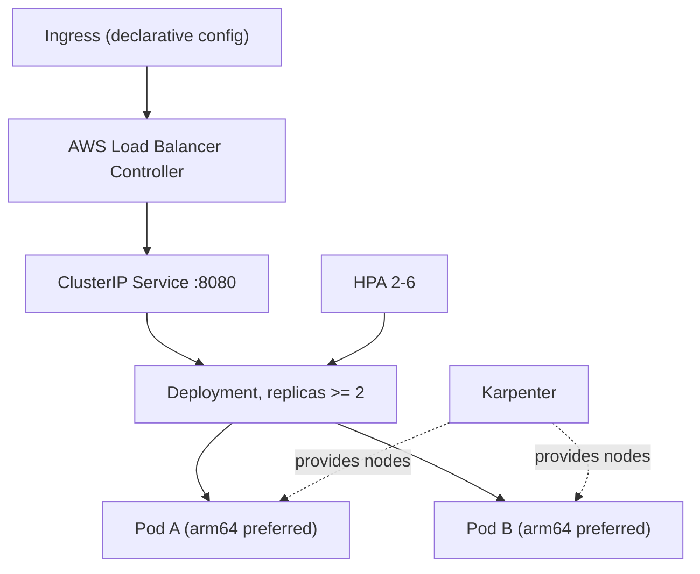

# echo-pong — Production AWS Reference Architecture

> **Status: DESIGN ONLY.** Nothing in this repository has been applied. No AWS
> account, DNS zone, Terraform state, or Kubernetes cluster has been touched.
> This README is the design/solution document required *before* any
> `terraform apply`, repo creation, commit, push, or image publish. Nothing
> here should be treated as "already deployed."

This document explains the optional, production-grade cloud reference
architecture for **echo-pong**, going beyond the base take-home assignment
(Minikube/Kind) to show how the same application would run in AWS.

---

## 1. Repository split and ownership

The solution is split across four repositories so that each layer has
exactly one owner and no Kubernetes object is ever managed by two systems
at once (Terraform *or* Argo CD, never both).

| Repository | Owns |
|---|---|
| `echo-pong` (this repo) | Go application source, unit tests, `Dockerfile`, local `Makefile`, thin caller GitHub Actions workflows only |
| `echo-pong-workflows` | Reusable CI: Go build/test/lint, multi-arch image build, vulnerability gates, SBOM, provenance, Cosign signing, binary releases, Helm/Terraform validation workflows, proposed GitOps promotion workflow |
| `echo-pong-gitops` | Helm chart, per-environment values, Argo CD `AppProject` / `Application(Set)` definitions, platform add-on declarations, the approved immutable ECR image digest, all Kubernetes desired state |
| `echo-pong-infrastructure` | AWS accounts/providers, Terraform state bootstrap, VPC, EKS, ECR, IAM + GitHub OIDC, KMS, Route 53, ACM, CloudFront, AWS WAF, Secrets Manager metadata, the Argo CD *bootstrap* only |

**Rule:** every AWS or Kubernetes resource has exactly one owner. Terraform
creates the cluster and bootstraps Argo CD — after that, Argo CD alone
manages Kubernetes objects. Terraform never touches app-level Kubernetes
resources again after bootstrap, and CI never runs `kubectl apply` against
the cluster.

---

## 2. Solution in one sentence

```
Developer
  → central reusable CI/CD workflows (echo-pong-workflows)
  → tested, scanned, signed multi-arch image in ECR (immutable digest)
  → reviewed GitOps pull request (echo-pong-gitops)
  → Argo CD
  → Helm
  → EKS on Graviton
  → ALB
  → AWS WAF
  → CloudFront
  → Route 53
  → users
```

---

## 3. Effective AWS request flow

```
Route 53 (alias)
  → CloudFront (TLS termination, edge routing, caching rules)
    → AWS WAF (Web ACL attached to CloudFront)
      → HTTPS to origin, with origin-verification header
        → Application Load Balancer (created by AWS LB Controller, internet-facing, IP target mode)
          → Target Group (Pod IPs, private subnets)
            → echo-pong Pods (multi-arch image, primarily on Graviton/arm64 nodes)
```

The **logical Kubernetes relationship** is declarative configuration only:

```
Ingress  →  ClusterIP Service  →  Pods
```

The **effective AWS data path** for real traffic is:

```
CloudFront  →  ALB  →  Pod IP
```

The Ingress object is *not* a second runtime proxy — it is reconciled by the
AWS Load Balancer Controller, which is what actually creates and updates the
ALB and its IP-mode target group. Traffic never passes "through" the Ingress
object itself.

---

## 4. Why CloudFront, not Global Accelerator

CloudFront is the implemented default because echo-pong is a plain HTTP
service that benefits from edge WAF, TLS termination, global routing,
request filtering, and optional caching of the public `/` documentation
endpoint.

Global Accelerator is **not** deployed. It is documented only as a future
option for: static anycast IPs, multi-region active/active routing, fast
regional failover, or TCP/UDP workloads that don't need caching. Important
caveat: **AWS WAF cannot attach directly to Global Accelerator** — if it is
ever adopted, the existing regional Web ACL would be re-associated with the
ALB instead of CloudFront.

### CloudFront behavior (per path)

| Path | Cache | Methods | Notes |
|---|---|---|---|
| `/ping*` | disabled | GET, HEAD | forwards `Authorization`; header never cached or logged |
| `/pong*` | disabled | GET, HEAD | forwards `Authorization`; header never cached or logged |
| `/health` | disabled | GET, HEAD | used as ALB health-check path too |
| `/` | disabled (default) | GET, HEAD | short-TTL caching documented as a *future* option — it's static docs, no auth |

Global CloudFront settings: HTTPS-only viewer policy, TLS 1.2+, HTTPS-only to
the origin, explicit cache policy / origin-request policy / response-headers
policy (not the "managed-all" defaults), compression only where useful,
security response headers (HSTS, `X-Content-Type-Options`, `Referrer-Policy`),
and access logging that excludes the `Authorization` header value.

---

## 5. Origin protection (defense in depth)

Goal: nobody should be able to call the ALB directly and skip CloudFront/WAF.

1. CloudFront injects a dedicated, random **origin-verification header**
   (a per-deployment secret value, *not* the app's bearer token).
2. The ALB listener rule only forwards requests that carry the expected
   header value; everything else gets a fixed deny response.
3. Regional AWS WAF at the ALB enforces the same rule as a second layer.
4. Where the design supports it, the ALB security group is restricted to
   CloudFront's origin-facing address ranges.
5. The verification value is generated at deploy time and stored only in
   AWS (e.g. Secrets Manager / SSM), never committed to Git.

This header is **not user authentication** — it only proves a request
transited the approved CloudFront → WAF → ALB path. Application auth is
still the `Authorization` bearer token checked by the Go app itself.

---

## 6. AWS WAF baseline

Web ACL attached to CloudFront, including:

- AWS Managed Rules — Common Rule Set
- AWS Managed Rules — Known Bad Inputs
- Amazon IP Reputation List
- A configurable rate-based rule
- CloudWatch metrics + sampled requests enabled
- New rule groups roll out in **count mode** first, then flip to block after
  a tuning window, with documented exclusions for observed false positives

Bot Control and other expensive managed groups are **not** enabled by
default — only if a specific abuse pattern justifies the added cost. The
Authorization header / app token is never logged or exposed in WAF logs.

---

## 7. Route 53 / TLS

- Uses an **existing** Route 53 public hosted zone (hosted-zone ID supplied
  as input) — never creates a duplicate zone.
- Creates: a Route 53 alias A/AAAA record → CloudFront, ACM DNS-validation
  records, and a CloudFront cert in `us-east-1` (via an aliased AWS
  provider, since CloudFront certs must live there regardless of the
  deployment region). A regional ALB cert is only created if the ALB needs
  to terminate a separate HTTPS listener of its own.
- Two AWS provider aliases are used: default (regional) and `us-east-1`
  (CloudFront/ACM).

Cutover: create the record with a low TTL first, validate end-to-end over
the CloudFront hostname, then flip DNS. Rollback: revert the alias record
(or repoint it) to the previous known-good target; ACM certs auto-renew via
DNS validation as long as the validation records stay in the zone.

---

## 8. EKS

- Control plane spans ≥ 2 AZs, private worker nodes only (no public IPs).
- Restricted EKS API endpoint access (private, or private + IP-allowlisted
  public).
- Control-plane logging enabled; Kubernetes Secrets encrypted with a
  customer-managed KMS key.
- Kubernetes version supplied as a validated Terraform variable (current
  supported version).
- Core add-ons: VPC CNI, CoreDNS, kube-proxy; EBS CSI driver only added if a
  workload actually needs persistent volumes (echo-pong doesn't).
- **EKS Pod Identity preferred**; IRSA used only where a controller/add-on
  doesn't yet support Pod Identity (e.g. depending on AWS Load Balancer
  Controller's supported version at implementation time — decision recorded
  in the IAM module docs). No static AWS access keys anywhere.

### Graviton compute strategy

- A small **EKS managed node group** (arm64) carries critical system
  components (CoreDNS, controllers) so the cluster isn't dependent on
  Karpenter being healthy to bootstrap itself.
- **Karpenter** provides dynamic application capacity; its `NodePool` /
  `EC2NodeClass` objects are managed through GitOps (echo-pong-gitops),
  *after* Karpenter itself is installed by Argo CD — Terraform only creates
  Karpenter's IAM prerequisites.
- arm64-capable families preferred, multi-AZ scheduling, configurable
  On-Demand/Spot mix, consolidation + disruption budgets enabled.

The Helm chart expresses Graviton preference as a **soft** node affinity
(`preferredDuringScheduling`, `kubernetes.io/arch=arm64`) rather than a hard
`nodeSelector`, plus amd64 tolerations/support since the image is
multi-arch. A hard requirement would leave Pods unschedulable — and thus
reduce availability below the required 2-replica minimum — during a
temporary Graviton capacity shortage; a soft preference lets the scheduler
fall back to amd64 nodes instead of failing Pods.

---

## 9. AWS Load Balancer Controller

Declared and installed by **Argo CD**, after Terraform finishes cluster
bootstrap. Terraform's job is limited to the AWS-side prerequisites: IAM
role + trust policy, required tags, and the EKS Pod Identity association (or
IRSA OIDC trust, per the decision above).

Once installed, the controller reconciles the `echo-pong` Ingress into:
an internet-facing ALB, IP target mode, HTTPS listeners (HTTP → HTTPS
redirect if HTTP is exposed at all), `/health` as the health-check path,
least-privilege security groups, and routing only to Pods that pass
readiness — never a NodePort.

---

## 10. ECR and the image pipeline

Two repositories are used deliberately, because scanning an image *after*
it's already in the production repo doesn't actually prevent publication:

```
echo-pong-quarantine   ← build lands here first
echo-pong               ← only approved digests are promoted here
```

```
Build (linux/amd64 + linux/arm64)
  → push manifest list to echo-pong-quarantine
    → scan every architecture manifest (Trivy) + generate SBOM
      → policy check: fail closed on HIGH/CRITICAL
        → PASS: promote the exact tested digest to echo-pong (no rebuild)
                → Cosign keyless sign + provenance attestation
                  → open a GitOps PR pinning the production digest
        → FAIL: blocked, quarantine image cleaned up, nothing promoted
```

Promotion re-tags/copies the already-scanned manifest list byte-for-byte —
it never rebuilds after scanning, so the image running in production is
provably the one that was tested.

Both repos have: tag immutability, encryption at rest, scan-on-push, and
least-privilege repo policies. `echo-pong-quarantine` gets a **much shorter**
lifecycle (short-lived by design); `echo-pong` gets separate retention
classes for SemVer releases, rollback candidates, dev images, PR images, and
untagged manifests. A lifecycle policy alone can't know what GitOps still
references, so any cleanup automation must diff candidate digests against
`echo-pong-gitops` (dev/staging/production) before deleting anything, and
never delete a digest inside an active rollback window.

Production always deploys a **digest**, never a tag:

```
<account>.dkr.ecr.<region>.amazonaws.com/echo-pong@sha256:<digest>
```

---

## 11. Secrets

The app secret lives in **AWS Secrets Manager**. Terraform provisions only
the secret's metadata and IAM read permissions — never the real value (not
in `.tf` files, not in state outputs, not in CI logs). The **External
Secrets Operator** (managed via GitOps) syncs it into the cluster and mounts
it as a **read-only file** at the path the app already expects via
`SECRET_FILE_PATH`. It is never passed as an env var, never in Helm values,
never in CloudFront config, never in WAF logs.

---

## 12. GitHub OIDC / IAM roles

Separate, least-privilege roles, trust-restricted by repo, org, branch/tag,
and GitHub Environment (no wildcard repo trust, no `AdministratorAccess`):

- CI validation (read-only, no deploy permissions)
- ECR release publication
- Terraform plan
- Terraform apply (gated by a GitHub Environment + required reviewers)
- Optional one-time infrastructure bootstrap role

---

## 13. GitOps bootstrap order

```
1. Terraform creates AWS infra + EKS cluster
2. Terraform bootstraps Argo CD only            ← the one Terraform→K8s exception
3. Argo CD reads echo-pong-gitops
4. Argo CD installs platform add-ons (LB Controller, Karpenter, ESO, ...)
5. Argo CD installs the echo-pong Helm release
6. From here on, all Kubernetes change goes through GitOps
```

Argo CD is scoped by a restricted `AppProject` (allowed repos, destination
cluster/namespaces, allowed cluster- and namespace-scoped kinds). Structure
is app-of-apps / `ApplicationSet` for platform add-ons + dev/staging/prod
echo-pong apps. Dev auto-syncs; **production requires a reviewed,
protected GitOps pull request** before Argo CD is allowed to sync it.
`prune`/`selfHeal` risk is documented per environment, sync windows are
defined where needed, and rollback is simply a Git revert to the previous
approved digest.

CI is never granted `kubectl apply` access to the cluster — it only opens
the GitOps PR.

---

## 14. Kubernetes internals



Pod hardening / HA: `startupProbe` accounting for the app's 10s startup
sleep, `readinessProbe`/`livenessProbe` on `/health` (liveness only starts
after startup succeeds), `runAsNonRoot`, read-only root filesystem, no Linux
capabilities, `seccompProfile: RuntimeDefault`, secret mounted as a
read-only file, topology spread across zone + hostname, `PodDisruptionBudget`,
`RollingUpdate` with `maxUnavailable: 0` and `maxSurge` large enough to
create the replacement Pod before removing the old one. `terminationGracePeriodSeconds`
and any `preStop` hook will only be added once verified against what the Go
binary actually does on shutdown — not assumed.

---

## 15. Network layering

AWS security groups, WAF, ALB listener rules, and Kubernetes
`NetworkPolicy` protect **different layers** and don't substitute for one
another — all are applied. `NetworkPolicy` defaults to deny-all
ingress/egress, then allows: ingress only from the AWS Load Balancer
Controller-managed path, egress only for the secret integration (ESO) and
required platform traffic, and DNS only where a component genuinely needs
it. Enforcement in EKS depends on the CNI/policy engine actually selected
(e.g. VPC CNI + a policy engine, or Calico) — this will be named explicitly
once chosen, and if local testing ever uses Kind, the README will say
plainly whether that Kind CNI enforces `NetworkPolicy` at all rather than
assume it does.

---

## 16. VPC

Public subnets (ALB), private subnets (EKS nodes/Pods), per-class route
tables, security groups, VPC Flow Logs where justified. VPC endpoints
evaluated for `ecr.api`, `ecr.dkr`, the S3 gateway endpoint, STS, Secrets
Manager, and CloudWatch Logs — note that ECR image *layers* are actually
served through S3, so private ECR pulls need **both** the ECR interface
endpoints **and** the S3 gateway endpoint, not just the former. Endpoints
reduce NAT traffic but don't eliminate every need for internet egress.

Two NAT strategies:

- **Production:** one NAT Gateway per AZ (full AZ-independence).
- **Development:** a single NAT Gateway, with reduced availability
  explicitly documented (an AZ outage affecting the NAT AZ takes egress
  down cluster-wide).

---

## 17. Terraform quality and state

A dedicated **bootstrap** layer (outside the normal root modules) creates
the encrypted, versioned S3 state bucket with public access blocked, state
locking, least-privilege access, and per-environment state keys — it does
not configure its own backend from a backend that doesn't exist yet.

CI on the infrastructure repo runs: `terraform fmt -check`, `terraform init`
with the backend disabled (validation only), `terraform validate`, TFLint,
Checkov, Trivy config scanning, Gitleaks, `terraform-docs` validation, and a
speculative plan when explicitly authorized. Providers are pinned, and
provider lock files are committed (and checksum-verified) for every
deployable root module. No secret values are ever stored in state.

---

## 18. Cost tiers

| | Development | Production |
|---|---|---|
| NAT | 1 Gateway (documented reduced HA) | 1 per AZ |
| Compute | small Graviton (t4g/c7g family), min replicas | multi-AZ, autoscaled, Karpenter |
| WAF | minimal managed rule set | full baseline (CRS, bad inputs, IP reputation, rate limit) |
| Logs | short retention | production retention |
| Global Accelerator | not deployed | not deployed (documented future option only) |
| GitOps | auto-sync | protected PR + required review |

Exact dollar figures depend on region, chosen instance sizes, and traffic —
these will be produced as a line-item estimate (NAT Gateway hours, ALB/CloudFront
request pricing, EKS control plane fee, node hours, WAF request pricing,
Secrets Manager, KMS) in the plan-review step **before** anything is applied.
Resources that keep costing money while fully idle: EKS control plane, NAT
Gateway(s), ALB, any Karpenter-held minimum node capacity, Route 53 hosted
zone, CloudFront distribution (near-zero at idle but not exactly zero), and
KMS key storage.

---

## 19. Acceptance criteria (tracking)

All of the following must be demonstrated, or explicitly marked **blocked —
pending AWS authorization**, before this design is considered "done":

- [ ] `terraform fmt`/`validate` pass
- [ ] TFLint passes
- [ ] Checkov / Trivy config scan pass
- [ ] `helm lint` passes
- [ ] `helm template` output passes strict `kubeconform`
- [ ] Multi-arch image manifest contains both `amd64` and `arm64`
- [ ] Trivy gate correctly fails on HIGH/CRITICAL
- [ ] SBOM generated, image digest recorded
- [ ] GitOps values reference the immutable digest (never `:latest`)
- [ ] Argo CD reports `Synced`/`Healthy` — **blocked, needs an authorized AWS env**
- [ ] ALB targets healthy — **blocked**
- [ ] Route 53 resolves the hostname — **blocked**
- [ ] TLS validates, HTTP→HTTPS redirect works — **blocked**
- [ ] `/health` → 200, `/` → 200 — **blocked**
- [ ] `/ping` no token → 401, wrong token → 401, correct token → 200 — **blocked**
- [ ] Direct origin bypass rejected — **blocked**
- [ ] No secret in Git, state, workflow logs, image metadata, or logs
- [ ] Rollback to a prior digest tested — **blocked, needs an authorized AWS env**

Anything marked **blocked** requires an approved AWS account, a real hosted
zone, and explicit sign-off to `terraform apply` — none of which has
happened yet.

---

## 20. Repository layout (planned)

```
echo-pong-infrastructure/
├── README.md
├── bootstrap/
│   └── terraform-state/          # encrypted S3 backend + DynamoDB/S3 lock, created once, by hand or a one-time apply
└── terraform/
    ├── modules/
    │   ├── vpc/
    │   ├── eks/
    │   ├── ecr/
    │   ├── iam/
    │   ├── github-oidc/
    │   ├── route53/
    │   ├── acm/                  # us-east-1 provider alias for CloudFront certs
    │   ├── cloudfront/
    │   ├── waf/
    │   ├── secrets-manager/      # metadata + IAM only, never the value
    │   └── argocd-bootstrap/     # the one allowed Terraform->K8s exception
    └── environments/
        ├── dev/
        ├── staging/
        └── production/
```

For context, the sibling repositories this one is designed against:

```
echo-pong/                       # Go app, tests, Dockerfile, Makefile, thin CI callers (this repo)
echo-pong-workflows/             # reusable CI/CD: build, scan, sign, release, promote
echo-pong-gitops/                # Helm chart, env values, Argo CD Application(Set)s
```

---

## 21. What happens next

This document is the design/solution artifact required before any mutating
action against AWS. Per the constraints for this work, none of the
following happen without explicit, separate approval:

- any `terraform apply` or AWS resource creation
- Route 53 / DNS changes
- publishing any container image to production ECR

The next step, once approved, is to scaffold the actual Terraform modules
in `echo-pong-infrastructure`, run `fmt`/`validate`/TFLint/Checkov locally,
and bring back real validation output before touching AWS.
